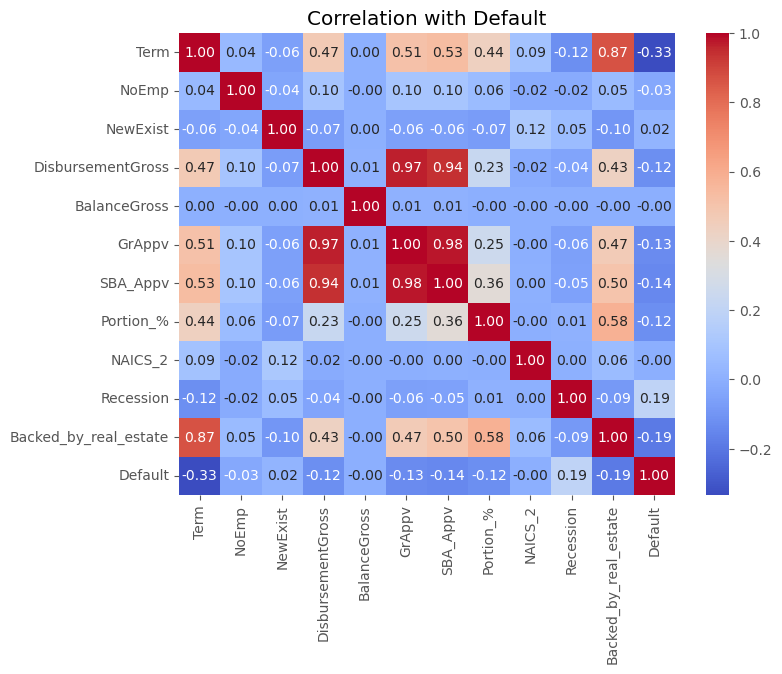

# SBA Loan Approval Prediction using Predictive Modeling and Analysis

> Predicting loan approvals is crucial for financial institutions to assess risk, streamline decision-making, and ensure transparency in lending. This project aims to leverage machine learning models to predict loan approval outcomes based on applicant data, enabling better resource allocation and customer satisfaction.


## Table of Contents

- [Overview](#overview)
- [Screenshots](#screenshots)
- [Libraries Used](#libraries-used)
- [How It Works](#how-it-works)
- [Code Snippets](#code-snippets)
- [Features](#features)
- [Status](#status)
- [Challenges](#challenges)
- [Learnings](#learnings)
- [Contact](#contact)

## Overview

This project analyzes historical U.S. Small Business Administration (SBA) loan data to develop predictive models for loan default risk. Using advanced machine learning techniques, including K-Nearest Neighbors (kNN), Classification Trees, Logistic Regression, Neural Networks, and Discriminant Analysis, we aimed to improve the loan approval process. The data can be downloaded from [here](https://drive.google.com/file/d/1LGKdxoDwP_jypAnB_o7HKJheoXpTS9qv/view?usp=sharing).

## Screenshots

### Visualizations from the Project:

1. **EDA**:

   
   - This chart explores the distribution of loan defaults and loan approvals.
   
   
   - This chart explain the distribution of loan defaults and approvals across different states.

2. **Correlation of features**:

   
   - This heatmap depicts the correlation among for all the features.

3. **Comparision of the models**:

   
   - This table shows a comparision of performances from different models on various metrics.

## Libraries Used

- **Pandas**
- **Numpy**
- **Matplotlib**
- **Seaborn**
- **Scikit-learn**
- **dmba**
- **XGBoost**

## How It Works

1. **Import Libraries and Setup**: Import necessary libraries and set up the environment..
2. **Data Loading**: Load the loan applicant dataset.
3. **Initial Inspection**:  Examine the dataset structure, including missing values and data types.
4. **Data Cleaning**: Handle missing values and drop unnecessary columns.
5. **Feature Engineering**: Select features, encode categorical variables, and scale numerical values.
6. **Threshold Selection**: Analyze the distribution of probabilities generated by the model and use a cost-benefit analysis approach to determine an optimal threshold. The thresholds were evaluated based on maximizing total benefits, balancing recall and precision, and visualizing trade-offs. The chosen threshold ensures a balance between approving loans and minimizing false positives.
7. **Model Training**: Train models like logistic regression and random forest classifiers, optimizing hyperparameters for better performance.
8. **Evaluation**: Use metrics such as accuracy and confusion matrices to evaluate model predictions.

## Code Snippets
```python
# Example: Random Forest Classifier with Grid Search
from sklearn.ensemble import RandomForestClassifier
from sklearn.model_selection import GridSearchCV

rf = RandomForestClassifier()
param_grid = {'n_estimators': [100, 200], 'max_depth': [10, 20]}
grid_search = GridSearchCV(rf, param_grid, cv=5)
grid_search.fit(X_train, y_train)
print(f"Best Params: {grid_search.best_params_}")
```

```python
# Predict probabilities for the positive class (1 - Default) on the training data
y_probs_train = rf.predict_proba(X_train2)[:, 1]

# Extract DisbursementGross values
disbursement_gross_values_train = df_sampled2['DisbursementGross'].values

# Define thresholds to evaluate
thresholds = np.arange(0, 1.01, 0.01)
total_benefits_train = []

for threshold in thresholds:
    y_pred_train = (y_probs_train >= threshold).astype(int)
    total_benefit_train = 0

    for actual, predicted, loan in zip(y_train2, y_pred_train, disbursement_gross_values_train):
        if predicted == 0 and actual == 0:  # True Negative
            total_benefit_train += 0.05 * loan
        elif predicted == 0 and actual == 1:  # False Negative
            total_benefit_train += 0
        elif predicted == 1 and actual == 0:  # False Positive
            total_benefit_train -= 0.25 * loan
        elif predicted == 1 and actual == 1:  # True Positive
            total_benefit_train += 0

    total_benefits_train.append(total_benefit_train)

# Find the optimal threshold
optimal_idx_train = np.argmax(total_benefits_train)
optimal_threshold_train = thresholds[optimal_idx_train]
print("Optimal Threshold:", optimal_threshold_train)
```

## Features

### Current Features

- Predicts loan approval outcomes based on applicant information.
- Handles missing data and performs feature scaling.
- Visualizes key insights from the data.

### Future Enhancements

- Add a user interface for real-time predictions.

## Status

- **Completed**: Initial version finalized, but further improvements are welcome.

## Challenges

- Addressing missing values in key features.
- Balancing the dataset for improved model performance.
- Determining optimal thresholds required iterative testing and evaluation.

## Learnings

- Enhanced skills in data cleaning and preprocessing.
- Learned effective feature engineering techniques.
- Gained experience in evaluating multiple machine learning models.
- Developed an understanding of threshold tuning for better classification.

## Contact

Feel free to reach out for collaboration or feedback. **Created by:** Me and my teammates - Komal Nayak, Vibha Gupta

Connect with me:

- **Email**: [osheengupta1994@gmail.com](mailto\:osheengupta1994@gmail.com)
- **GitHub**: [osheengupta](https://github.com/osheengupta)
- **LinkedIn**: [Osheen Gupta](https://linkedin.com/in/osheengupta/)
